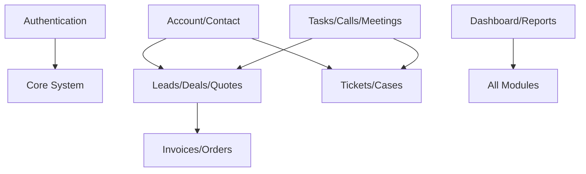

# CRM Workflows, Architecture & Business Logic
## CRM Unified Suite – Enterprise Sales, Support & Operations Management System

---

### 1. Module Dependency Architecture

The CRM Unified Suite is built on a modular architecture where components are interconnected but maintain clear boundaries. Below is the dependency flow:

- **Core Layer (No external dependencies)**: Authentication & Role Management, Settings & Configuration.
- **Data Layer (Depends on Core)**: Account/Company Management, Contact Management.
- **Sales Layer (Depends on Data Layer)**: Lead Management, Opportunity/Deal Pipeline, Quote & Approval Workflow, Product & Pricing, Sales Order / Invoice.
- **Support Layer (Depends on Data Layer)**: Customer Support / Ticketing.
- **Interaction Layer (Cross-cutting)**: Task & Activity Management, Call Queue / Follow-up System, Meeting Scheduling, Notifications.
- **Insight Layer (Aggregates all)**: Reports & Analytics, Dashboard.

#### Dependency Diagram (Text-Based)

---

### 2. End-to-End Workflows

#### 2.1 Lead-to-Cash Workflow (Sales)
This is the primary workflow for the sales team, taking a prospect from initial contact to paid invoice.

1. **Lead Generation**: A lead enters the system (manual entry or via API from a marketing campaign).
2. **Assignment**: The system auto-assigns the lead to a Sales Rep based on round-robin rules.
3. **Contact & Qualification**: The Rep calls or emails the lead. Activities are logged in the Timeline.
4. **Conversion**: Once qualified, the lead is converted. The system automatically creates:
   - An **Account** (the company).
   - A **Contact** (the person).
   - A **Deal** (the opportunity).
5. **Pipeline Management**: The Deal is placed in the "Qualification" stage of the Kanban board.
6. **Quote Creation**: The Rep generates a Quote from the Deal, adding products and applying a discount.
7. **Approval**: If the discount exceeds 10%, a notification is sent to the Sales Manager for approval.
8. **Customer Acceptance**: The quote is sent to the customer and marked "Approved" by the customer.
9. **Invoicing**: The quote is converted to an Invoice.
10. **Payment**: The customer pays, and the invoice status changes to "Paid", closing the deal as "Won".

#### 2.2 Ticket Resolution Workflow (Support)
1. **Ticket Creation**: A customer submits a ticket via portal or email.
2. **Triaging**: Support Manager reviews and assigns to an Agent based on priority and workload.
3. **Investigation**: Agent updates status to "In Progress" and contacts the customer or references the Knowledge Base.
4. **Resolution**: Agent resolves the issue, logs the solution, and marks the ticket "Resolved".
5. **Feedback**: System auto-sends a feedback survey to the customer.

---

### 3. User Journeys & Workflows

#### 3.1 Sales Representative Journey
- **Daily Start**: Checks Dashboard for tasks due today and pipeline status.
- **Lead Nurturing**: Works through the Call Queue to contact new leads. Logs outcomes.
- **Deal Progression**: Updates deal stages on the Kanban board after client meetings.
- **Quote Generation**: Builds quotes for clients and follows up on approvals.

#### 3.2 System Administrator Workflow
- **User Onboarding**: Creates new users, assigns roles, and sets up permissions.
- **System Configuration**: Updates global settings, currency, and enables/disables modules.
- **Monitoring**: Checks Audit Logs for system activity and security events.

---

### 4. Database Relationship Explanation

The database schema uses standard relational concepts to ensure data integrity:

- **User to Role (Many-to-Many)**: A user can have multiple roles, and a role can be assigned to multiple users.
- **Account to Contact (One-to-Many)**: A company (Account) can have many employees (Contacts), but a contact usually belongs to one primary account.
- **Account to Deal (One-to-Many)**: An account can have multiple sales opportunities over time.
- **Lead to Account/Contact/Deal (One-to-One on conversion)**: A lead record transitions into these three records, maintaining a link for history.
- **Deal to Quote (One-to-Many)**: A deal can have multiple quote versions, but only one is usually active.
- **Quote to Invoice (One-to-One)**: A specific quote maps to a specific invoice.

---

### 5. Complete Business Logic Explanation

#### 5.1 Deal Scoring Engine (Gravity & Momentum)
- **Gravity Score**: Calculated as `BaseScore - (DaysInStage * DecayFactor)`. It represents the "pull" or risk of a deal stalling. Active interactions (calls, emails) reset the decay.
- **Momentum Score**: Calculated based on the velocity of stage transitions. Moving from Prospecting to Proposal in 2 days gives higher momentum than taking 20 days.

#### 5.2 Quote Approval Logic
- **Rule**: Any quote with a discount > 10% or Total Value > $10,000 must be approved.
- **Technical Flow**: The save operation triggers a check. If conditions are met, the status is set to `PENDING_APPROVAL` and a Celery task dispatches a notification to the manager. The record is locked for editing by the Rep until action is taken.
